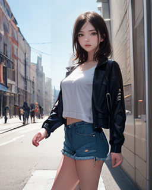
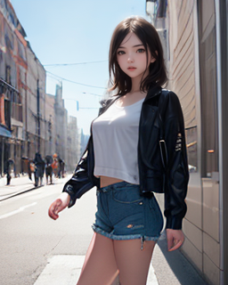

# ComfyUI-Impact-Pack

## Custom nodes pack for ComfyUI

# Features
* MMDetLoader - Load MMDet model
* SegmDetector - Detect segmentation and return mask from input image.
* BboxDetector - Detect bbox(bounding box) and return mask from input image.
* BitwiseAndMask - Perform 'bitwise and' operations between 2 masks
* SubtractMask - Perform subtract operations between 2 masks
* SegmDetectorForEach - Detect segmentation and return SEGS from input image.
* BboxDetectorForEach - Detect bbox(bounding box) and return SEGS from input image.
* DetailerForEach - Refine image rely on SEGS.
* BitwiseAndMaskForEach - Perform 'bitwise and' operations between 2 SEGS.
* BitwiseAndMaskForEach - Perform subtract operations between 2 SEGS.

# Installation

1. Download 'comfyui-impact-pack.py' 
2. Copy into 'ComfyUI/custom_nodes'
3. Restart ComfyUI (additional dependencies will be installed automatically)

* Due to compatibility issues between mmcv and PyTorch, it is recommended to use pytorch==1.13.1. Environment setup for PyTorch 2.0.0 is under testing.
* !pip -q install xformers torch==1.13.1 torchdiffeq torchsde einops open-clip-torch transformers>=4.25.1 safetensors pytorch_lightning aiohttp accelerate pyyaml
* You can use this colab notebook [colab notebook](https://colab.research.google.com/github/ltdrdata/ComfyUI-Impact-Pack/blob/Main/notebook/comfyui_colab_impact_pack.ipynb) to launch it. This notebook automatically downloads the impact pack to the custom_nodes directory, installs the tested dependencies, and runs it.

# How to use (DDetailer feature)

#### 1. Basic auto face detection and refine exapmle.

 
* The face that has been damaged due to low resolution is restored with high resolution by generating and synthesizing it, in order to restore the details.
* You can load models for bbox or segm using MMDetLoader. If you load a bbox model, only **BBOX_MODEL** is valid in the output, and if you load a segm model, only **SEGM_MODEL** is valid.
* The default downloaded bbox model currently only detects the face area as a rectangle, and the segm model detects the silhouette of a person.
* The difference between BboxDetectorCombine and BboxDetectorForEach is that the former outputs a single mask by combining all detected bboxes, and the latter outputs SEGS consisting of various information, including the cropped image, mask pattern, crop position, and confidence, for each detection. SEGS can be used in other ...ForEach nodes.

* Detector Node
    * threshold: Detect only those object whose recognized confidence is above this set value.
    * dilation: Expand the detected mask area.
    * crop_factor: Determine how many times the surrounding area should be included in the detail recovery process based on the detected mask area. If this value is small, the restoration may not work well because the surrounding context cannot be known.
* Detailer Node
    * guide_size: This feature attempt detail recovery only when the size of the detected mask is smaller than this value. If the size is larger, this feature increase the resolution and attempt detail recovery.
    * feather: When compositing the recovered details onto the original image, this feature use a gradient to composite it so that the boundaries are not visible. The thickness of this gradient is determined.
    * This feature adopt the properties of KSampler because this feature use it to recover details.

#### 2. 2Pass refine (restore a severely damaged face)

  
* In the first stage, the severely damaged face is restored to some extent, and in the second stage, the details are restored

#### 3. Face Bbox(bounding box) + Person silhouette segmantation (prevent distortion of the background.)

  

* In the second picture, you can see that the background is slightly distorted into a rectangle shape. In the third picture, only the overlapping part between the bbox and the seg is refined to prevent distortion of the background.

#### Mask feature

# Credits

ComfyUI/[ComfyUI](https://github.com/comfyanonymous/ComfyUI) - A powerful and modular stable diffusion GUI.

dustysys/ddetailer[ddetailer](https://github.com/dustysys/ddetailer) - DDetailer

hysts/[anime-face-detector](https://github.com/hysts/anime-face-detector) - Creator of `anime-face_yolov3`, which has impressive performance on a variety of art styles.

skytnt/[anime-segmentation](https://huggingface.co/datasets/skytnt/anime-segmentation) - Synthetic dataset used to train `dd-person_mask2former`.

jerryli27/[AniSeg](https://github.com/jerryli27/AniSeg) - Annotated dataset used to train `dd-person_mask2former`.

open-mmlab/[mmdetection](https://github.com/open-mmlab/mmdetection) - Object detection toolset. `dd-person_mask2former` was trained via transfer learning using their [R-50 Mask2Former instance segmentation model](https://github.com/open-mmlab/mmdetection/tree/master/configs/mask2former#instance-segmentation) as a base.

