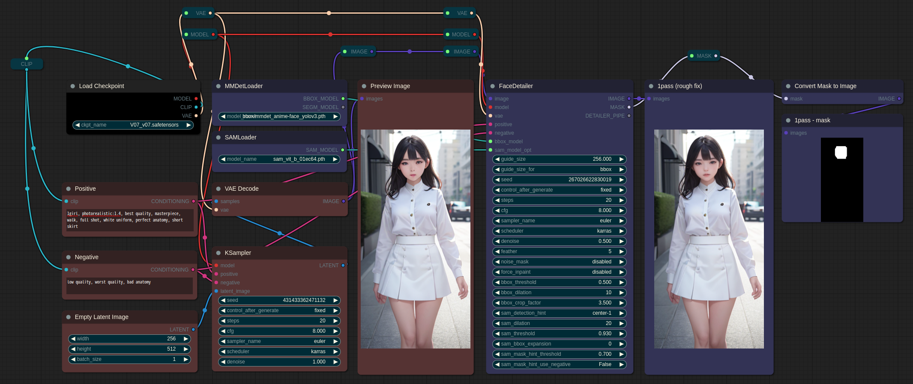
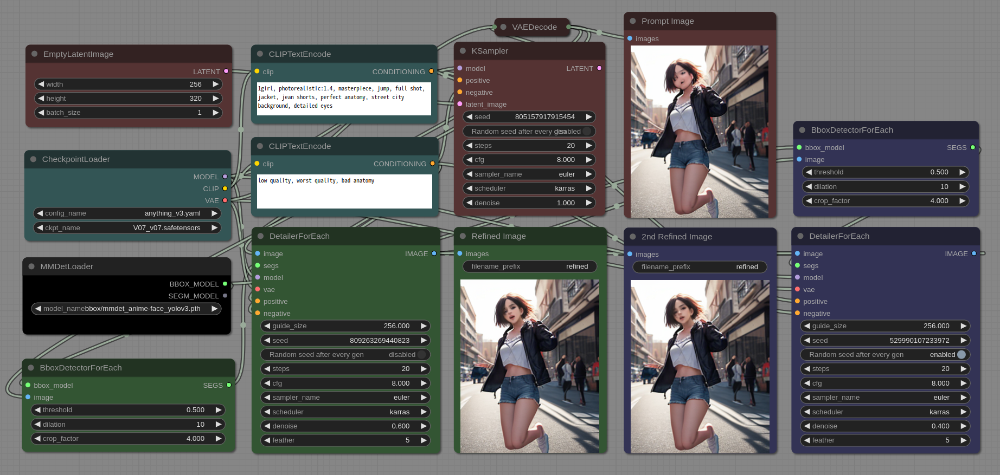
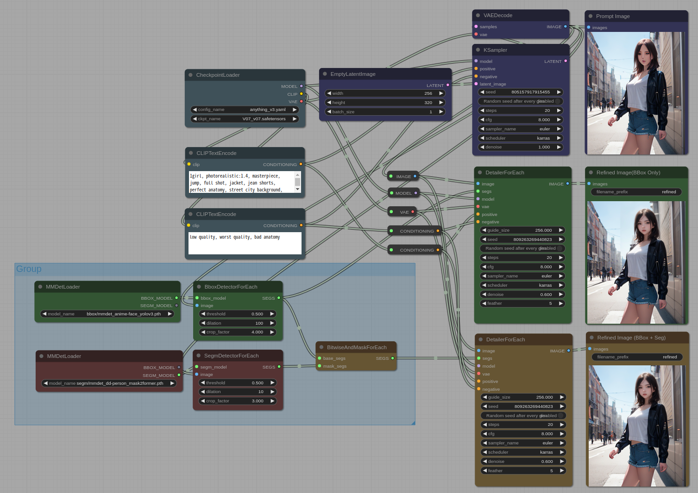
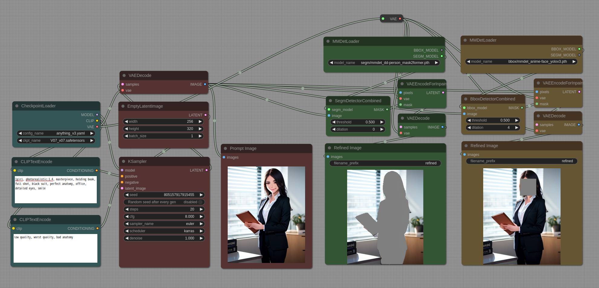
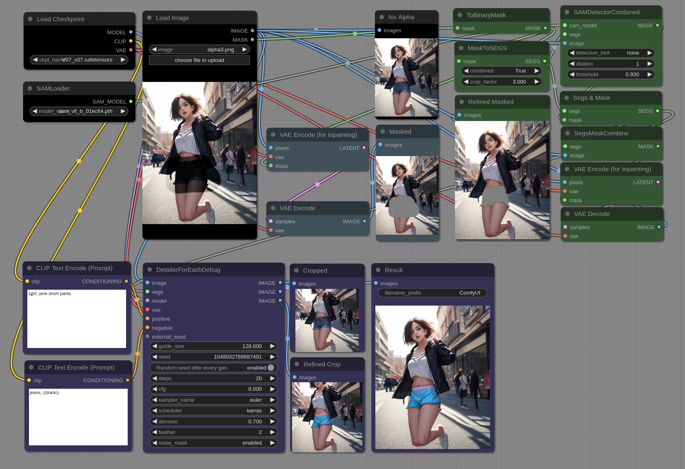
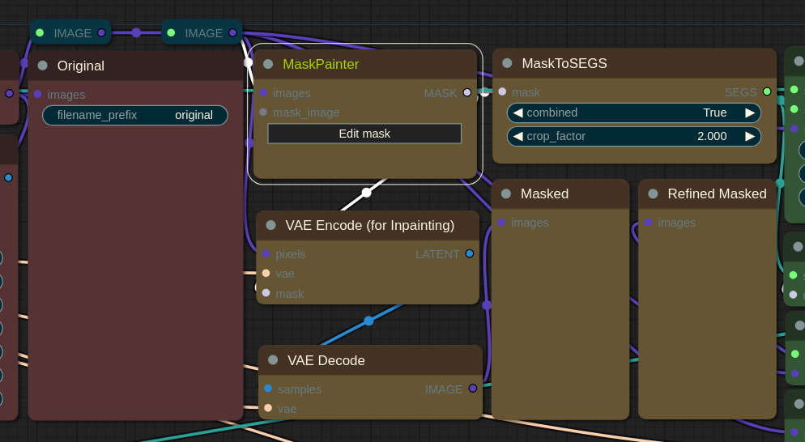
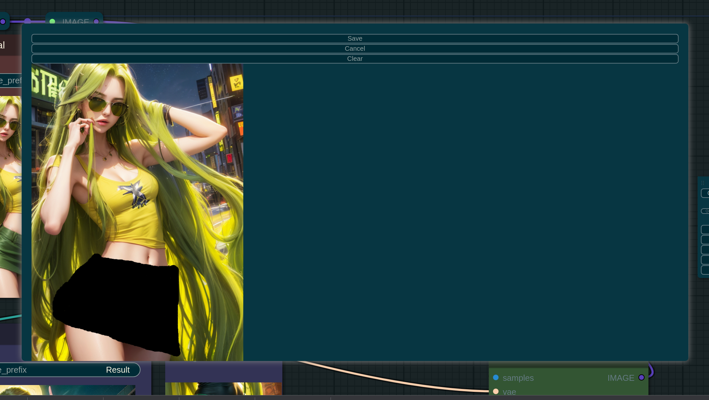

# ComfyUI-Impact-Pack

## Custom nodes pack for ComfyUI

# Features
* MMDetLoader - Load MMDet model
* SAMLoader - Load SAM model
* ONNXLoader - Load ONNX model
* SegmDetectorCombined - Detect segmentation and return mask from input image.
* BboxDetectorCombined - Detect bbox(bounding box) and return mask from input image.
* SamDetectorCombined - Using the technology of SAM, extract the segment at the location indicated by the input SEGS on the input image, and output it as a unified mask. 
* BitwiseAndMask - Perform 'bitwise and' operations between 2 masks
* SubtractMask - Perform subtract operations between 2 masks
* SegmDetectorForEach - Detect segmentation and return SEGS from input image.
* BboxDetectorForEach - Detect bbox(bounding box) and return SEGS from input image.
* ONNXDetectorForeach - Using the ONNX model, identify the bbox and retrieve the SEGS from the input image
* DetailerForEach - Refine image rely on SEGS.
* DetailerForEachDebug - Refine image rely on SEGS. Additionally, you can monitor cropped image and refined image of cropped image.
   * The 'DetailerForEach' and 'DetailerForEachDebug' now support an 'external_seed' that is obtained from the Seed node on the [WAS suite](https://github.com/WASasquatch/was-node-suite-comfyui)
   * To prevent the regeneration caused by the seed that does not change every time when using 'external_seed', please disable the 'seed random generate' option in the 'Detailer...' node
* BitwiseAndMaskForEach - Perform 'bitwise and' operations between 2 SEGS.
* BitwiseAndMaskForEach - Perform subtract operations between 2 SEGS.
* Segs & Masks - Perform a bitwise AND operation on SEGS and MASK.
* MaskToSegs - This node generates SEGS based on the mask. 
* ToBinaryMask - This node separates the mask generated with alpha values between 0 and 255 into 0 and 255. The non-zero parts are always set to 255.
* EmptySEGS - This node provides a empty SEGS.
* MaskPainter - This node provides a feature to draw masks.

# Installation

1. Download 'comfyui-impact-pack.py' 
2. Copy into 'ComfyUI/custom_nodes'
3. Restart ComfyUI (additional dependencies will be installed automatically)

* You can use this colab notebook [colab notebook](https://colab.research.google.com/github/ltdrdata/ComfyUI-Impact-Pack/blob/Main/notebook/comfyui_colab_impact_pack.ipynb) to launch it. This notebook automatically downloads the impact pack to the custom_nodes directory, installs the tested dependencies, and runs it.

# Package Dependencies (If you need to manual setup.)

* pip install
   * openmim
   * segment-anything
   * pycocotools
   
* mim install
   * mmcv==2.0.0, mmdet==3.0.0, mmengine==0.7.2
   
# Other Materials (auto-download on initial startup)

* ComfyUI/models/mmdets/bbox <= https://huggingface.co/dustysys/ddetailer/resolve/main/mmdet/bbox/mmdet_anime-face_yolov3.pth
* ComfyUI/models/mmdets/bbox <= https://raw.githubusercontent.com/Bing-su/dddetailer/master/config/mmdet_anime-face_yolov3.py
* ComfyUI/models/sams <= https://dl.fbaipublicfiles.com/segment_anything/sam_vit_b_01ec64.pth

# Troubleshooting page
* [Troubleshooting Page](troubleshooting/TROUBLESHOOTING.md)

# How to use (DDetailer feature)

#### 1. Basic auto face detection and refine exapmle.

  
* The face that has been damaged due to low resolution is restored with high resolution by generating and synthesizing it, in order to restore the details.
* You can load models for bbox or segm using MMDetLoader. If you load a bbox model, only **BBOX_MODEL** is valid in the output, and if you load a segm model, only **SEGM_MODEL** is valid.
   * Currently, we are using the more sophisticated SAM model instead of the SEGM_MODEL for silhouette extraction.

* The default downloaded bbox model currently only detects the face area as a rectangle, and the segm model detects the silhouette of a person.
* The difference between BboxDetectorCombine and BboxDetectorForEach is that the former outputs a single mask by combining all detected bboxes, and the latter outputs SEGS consisting of various information, including the cropped image, mask pattern, crop position, and confidence, for each detection. SEGS can be used in other ...ForEach nodes.

* The "noise_mask" option determines whether to add noise only to the masked area when generating an image using "KSampler". If enabled, denoising will not be applied outside the masked area, which can result in a safer generation with stronger denoising, but it may not always produce good results. The middle image shows the result when the "noise_mask" option is disabled, and the image on the right shows the result when the "noise_mask" option is enabled.

* Detector Node
    * threshold: Detect only those object whose recognized confidence is above this set value.
    * dilation: Expand the detected mask area.
    * crop_factor: Determine how many times the surrounding area should be included in the detail recovery process based on the detected mask area. If this value is small, the restoration may not work well because the surrounding context cannot be known.
* Detailer Node
    * guide_size: This feature attempt detail recovery only when the size of the detected mask is smaller than this value. If the size is larger, this feature increase the resolution and attempt detail recovery.
    * feather: When compositing the recovered details onto the original image, this feature use a gradient to composite it so that the boundaries are not visible. The thickness of this gradient is determined.
    * This feature adopt the properties of KSampler because this feature use it to recover details.

#### 2. 2Pass refine (restore a severely damaged face)

  
* In the first stage, the severely damaged face is restored to some extent, and in the second stage, the details are restored

#### 3. Face Bbox(bounding box) + Person silhouette segmantation (prevent distortion of the background.)

 

* Facial synthesis that emphasizes details is delicately aligned with the contours of the face, and it can be observed that it does not affect the image outside of the face.

* The BBoxDetectorForEach node is used to detect faces, and the SAMDetectorCombined node is used to find the segment related to the detected face. By using the Segs & Mask node with the two masks obtained in this way, an accurate mask that intersects based on segs can be generated. If this generated mask is input to the DetailerForEach node, only the target area can be created in high resolution from the image and then composited.

#### Mask feature

* SEGS generated by the ...Detector nodes can also be converted to a MASK using nodes such as SegsCombineMask and used accordingly.

#### SAMDetection Application

   

* By using the segmentation feature of SAM, it is possible to automatically generate the optimal mask and apply it to areas other than the face. The image on the left is the original image, the middle image is the result of applying a mask to the alpha channel, and the image on the right is the final result.

* The "detection_hint" in "SAMDetectorCombined" is a specifier that indicates which points should be included in the segmentation when performing segmentation. "center-1" specifies one point in the center of the mask, "horizontal-2" specifies two points on the center horizontal line, "vertical-2" specifies two points on the center vertical line, "rectangle-4" specifies four points in a rectangular shape inside the mask, and "diamond-4" specifies four points in a diamond shape centered around the center point.

* Unlike in face detection, for non-rigid objects, the center point may not always be the segmentation area, so be careful not to assume that the center point is always the segmentation area.

#### Mask Painter

* Click "Edit mask" button
* **Don't connect to 'mask_image' input**

* You can draw mask on Mask Painter
* Currently, this editor only provides basic functionalities

 
* When used together, SAMDetector and MaskPainter can be used to enhance specific elements of an image.

# Others Tutorials
* [Mask Pointer](tutorial/maskpointer.md)
* [ONNX Tutorial](tutorial/ONNX.md)

# Credits

ComfyUI/[ComfyUI](https://github.com/comfyanonymous/ComfyUI) - A powerful and modular stable diffusion GUI.

dustysys/[ddetailer](https://github.com/dustysys/ddetailer) - DDetailer for Stable-diffusion-webUI extension.

Bing-su/[dddetailer](https://github.com/Bing-su/dddetailer) - The anime-face-detector used in ddetailer has been updated to be compatible with mmdet 3.0.0, and we have also applied a patch to the pycocotools dependency for Windows environment in ddetailer.

facebook/[segment-anything](https://github.com/facebookresearch/segment-anything) - Segmentation Anything!

hysts/[anime-face-detector](https://github.com/hysts/anime-face-detector) - Creator of `anime-face_yolov3`, which has impressive performance on a variety of art styles.

open-mmlab/[mmdetection](https://github.com/open-mmlab/mmdetection) - Object detection toolset. `dd-person_mask2former` was trained via transfer learning using their [R-50 Mask2Former instance segmentation model](https://github.com/open-mmlab/mmdetection/tree/master/configs/mask2former#instance-segmentation) as a base.

WASasquatch/[was-node-suite-comfyui](https://github.com/WASasquatch/was-node-suite-comfyui) - A powerful custom node extensions of ComfyUI.
