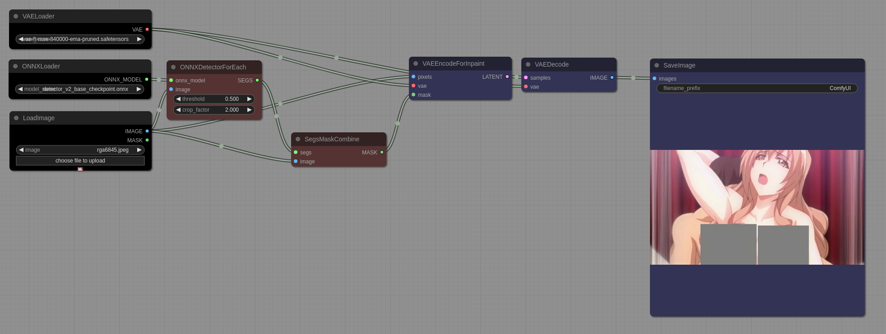

# NudeNet
Nudenet uses an ONNX model to detect NSFW content. This example is an application of [NudeNet](https://github.com/notAI-tech/NudeNet)'s capabilities, which detects NSFW elements in images and applies a mask as a post-processing step. This technique demonstrates the use of nudenet to detect potentially inappropriate content in order to ensure the safety of minors on certain websites

* [detector_v2_base_checkpoint.onnx](https://github.com/notAI-tech/NudeNet/releases/download/v0/detector_v2_base_checkpoint.onnx) is a model for nudenet. Download and placed into **ComfyUI/models/onnx**

* [onnx.json](../misc/onnx.json) is a workflow of this example.

# ONNX Models
* You can download various ONNX models from [here](https://github.com/PINTO0309/PINTO_model_zoo). 