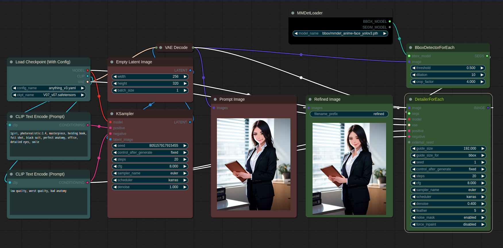

#### 1. Basic auto face detection and refine exapmle.

   
* You can load models for bbox or segm using MMDetLoader. If you load a bbox model, only **BBOX_MODEL** is valid in the output, and if you load a segm model, only **SEGM_MODEL** is valid.
   * Currently, Impact Pack is providing the more sophisticated SAM model instead of the SEGM_MODEL for silhouette extraction.

* The default downloaded bbox model currently only detects the face area as a rectangle, and the segm model detects the silhouette of a person.
* The difference between BboxDetectorCombine and BboxDetectorForEach is that the former outputs a single mask by combining all detected bboxes, and the latter outputs SEGS consisting of various information, including the cropped image, mask pattern, crop position, and confidence, for each detection. SEGS can be used in other ...ForEach nodes.

* The "noise_mask" option determines whether to add noise only to the masked area when generating an image using "KSampler". If enabled, denoising will not be applied outside the masked area, which can result in a safer generation with stronger denoising, but it may not always produce good results. The middle image shows the result when the "noise_mask" option is disabled, and the image on the right shows the result when the "noise_mask" option is enabled.

* Detector Node
    * threshold: Detect only those object whose recognized confidence is above this set value.
    * dilation: Expand the detected mask area.
    * crop_factor: Determine how many times the surrounding area should be included in the detail recovery process based on the detected mask area. If this value is small, the restoration may not work well because the surrounding context cannot be known.
  
* Detailer Node
    * guide_size: This feature attempt detail recovery only when the size of the detected mask is smaller than this value. If the size is larger, this feature increase the resolution and attempt detail recovery.
    * guide_size_for: This parameter determines whether guide_size is used based on the size of the detected face (bbox) or the size of the crop area that includes the face and is broadly cropped by crop_factor.
    * feather: When compositing the recovered details onto the original image, this feature use a gradient to composite it so that the boundaries are not visible. The thickness of this gradient is determined.
    * force_inpaint: force_inpaint will try to force regeneration even if it is smaller than guide_size . This function is useful when you simply want to change to another type of prompt other than the function to save details. However, in this case, upscale is forcibly fixed to 1.
    * This feature adopt the properties of KSampler because this feature use it to recover details.