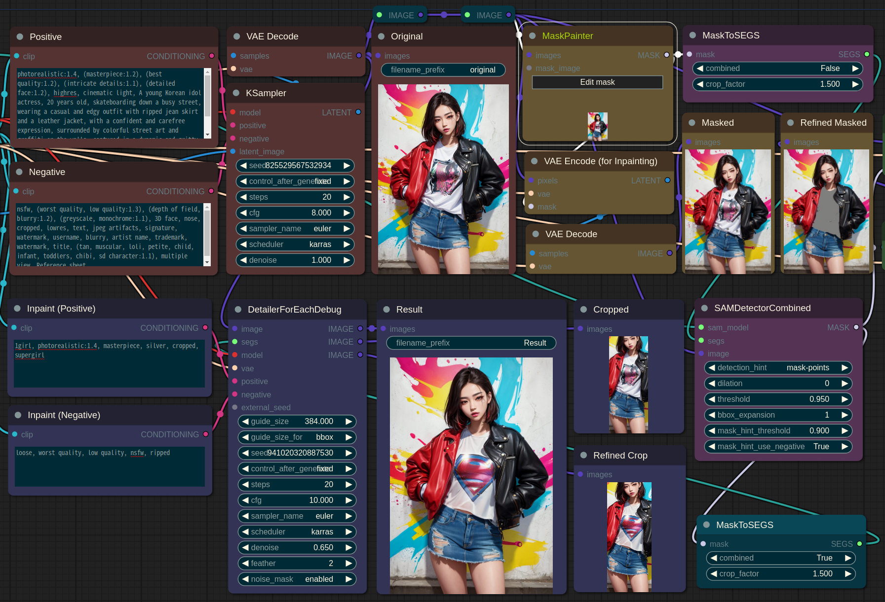
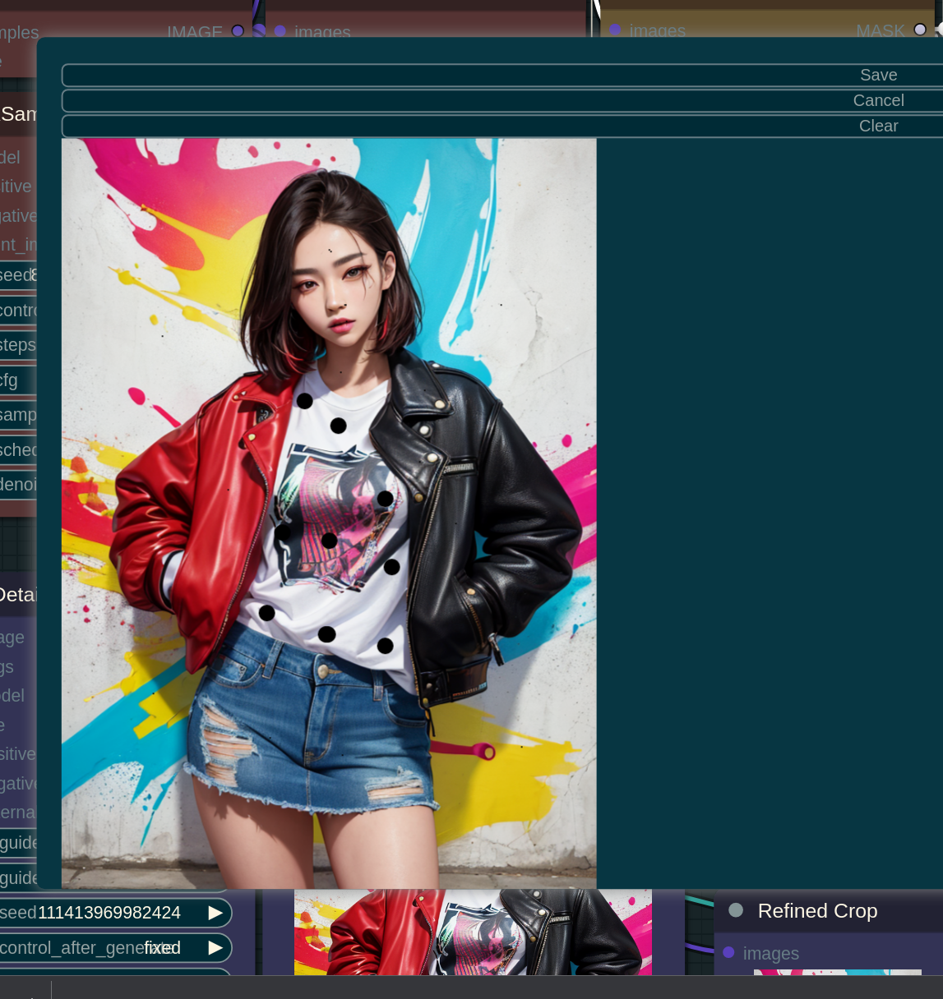

# Mask Pointer

* When setting the detection-hint as **mask-points** in SAMDetector, multiple mask fragments are provided as SAM prompts. If using **mask-area**, only some of the points within the float mask's inner area are provided as SAM prompts. When detection_hint_use_negative is set to True, very small dots are interpreted as negative prompts in mask-points, and some areas with a mask value of 0 are interpreted as negative prompts in **mask-area**. The **detection_hint_threshold** interprets cases where the mask value in **mask-area** is equal to or higher than the threshold as positive prompts. However, values greater than 0 but less than the **detection_hint_threshold** are not used as negative prompts.
* When using **mask-points**, please note that you should set "combined" parameter as **False** in MaskToSegs.

* When you adjust the mouse wheel up and down, you can adjust the size of the brush. When you hold down the left mouse button and drag, it will draw, and when you hold down the right mouse button and drag, it will erase.
* When using the mask_hint_use_negative as true in conjunction with the mask-points mode, large dots are interpreted as positive prompts and small dots are interpreted as negative prompts.

  

* By using **mask-points** or **mask-area**, you can select only certain parts, such as shirts or hair, to regenerate.